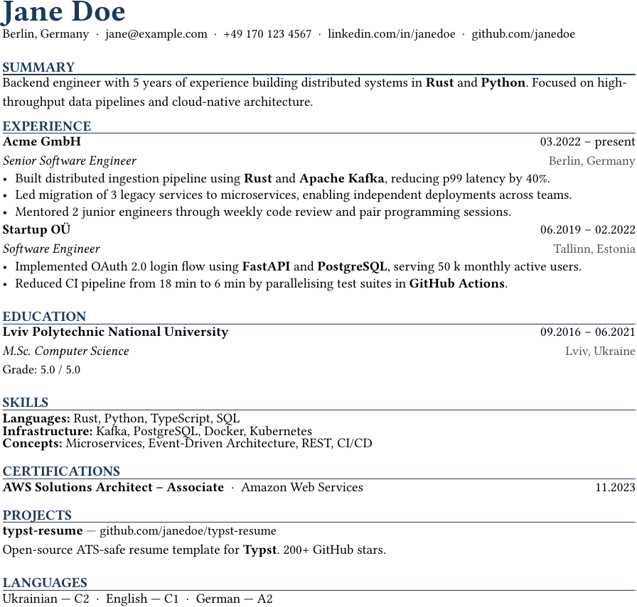
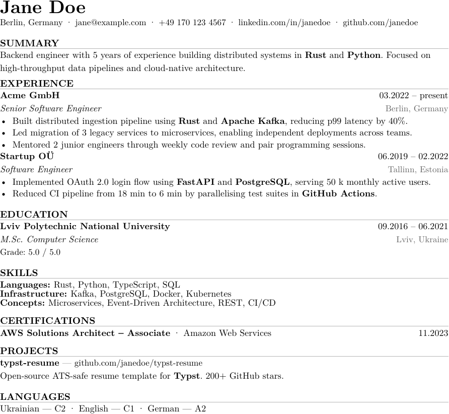
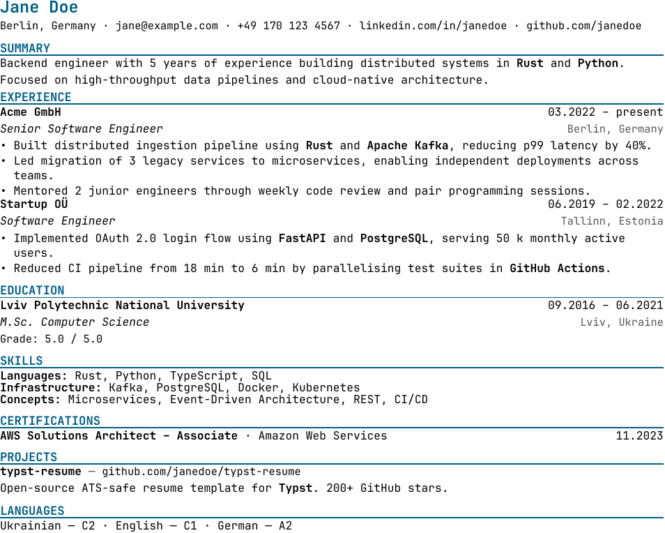
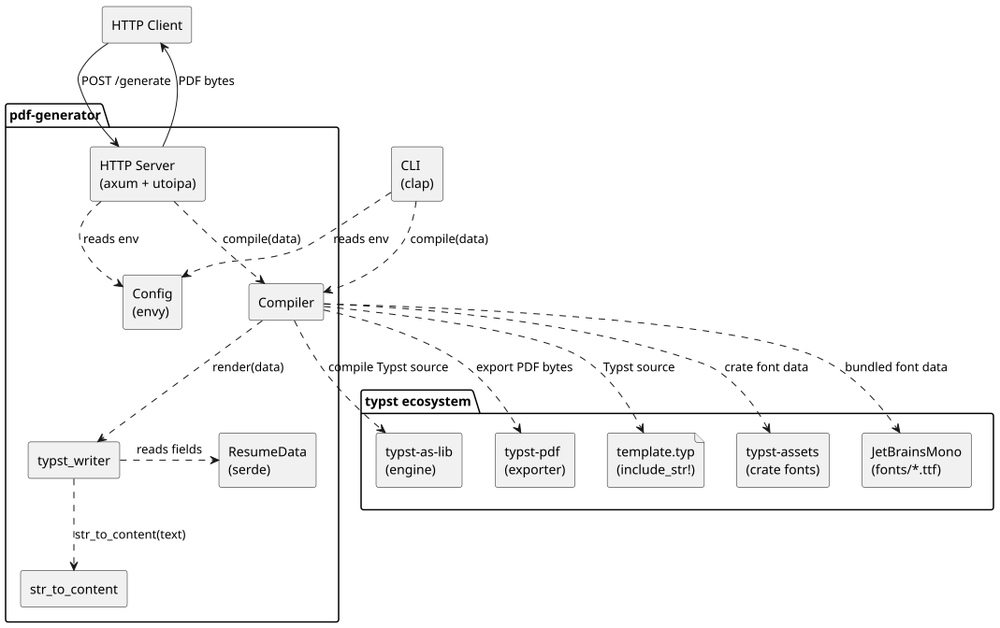
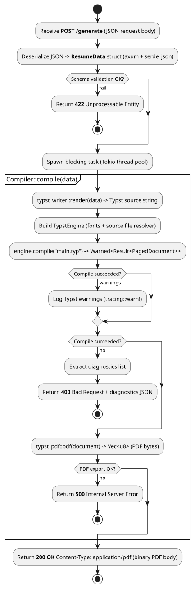
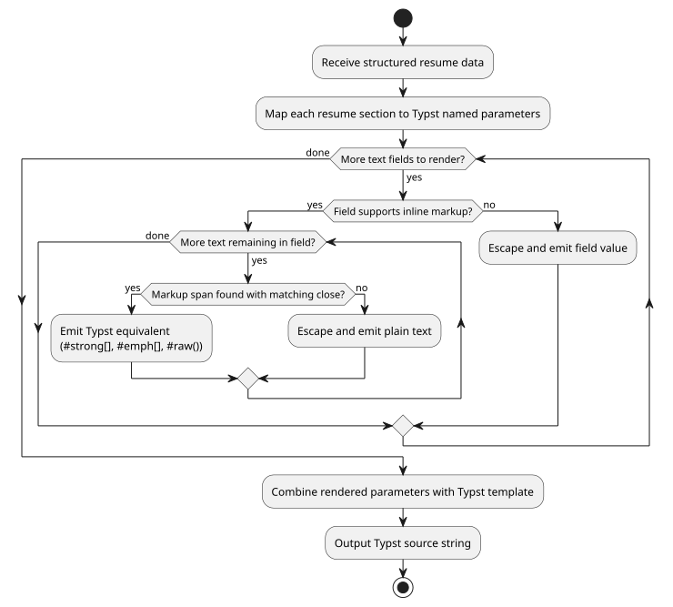
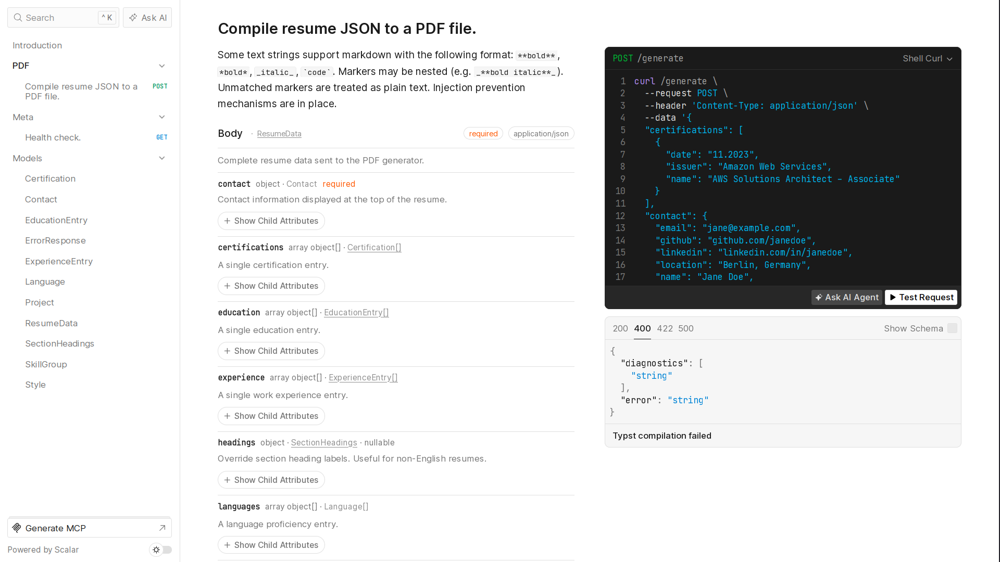
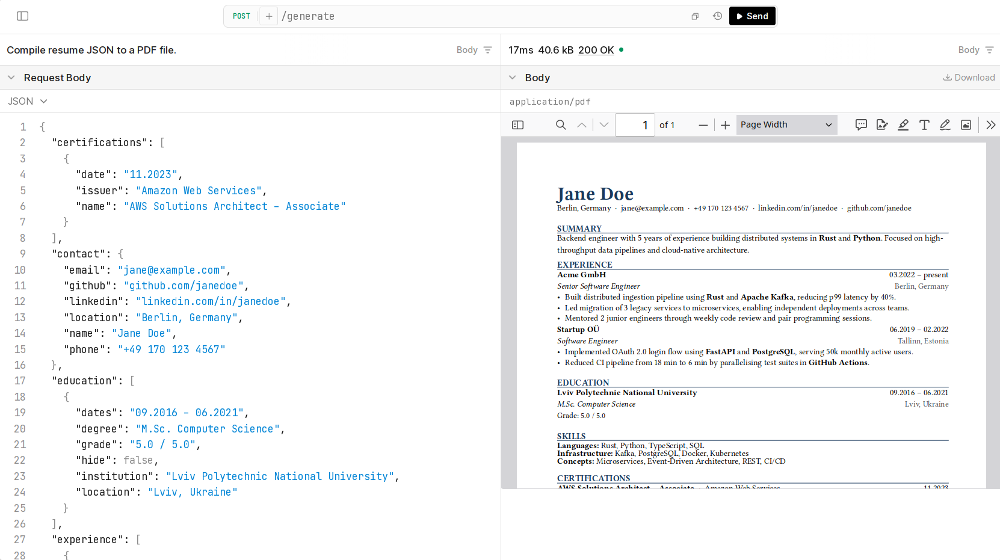

# pdf-generator

The resume export service for **GetJobAI**. It takes resume data as JSON and returns a print-ready, ATS-compatible PDF, compiled from a [Typst](https://typst.app) template entirely in memory. No temp files, no headless browser, no disk I/O.

It runs as an HTTP service or as a one-shot CLI.

```
JSON -> typed model -> Typst source -> Typst compiler -> PDF bytes
```

## Three styles, one template

The same data renders in three visual styles — `professional` (default), `minimal`, and `technical` that are selected by a single `style` field. All three share one data schema and the same ATS-safe structure; only typography, spacing, and colour differ.

| Professional | Minimal | Technical |
|:---:|:---:|:---:|
|  |  |  |

## ATS-safe by construction

Applicant Tracking Systems parse the PDF text layer, not the visual layout. Every style is built to survive that:

- **Single-column layout**: multi-column defeats most parsers.
- **Real Unicode glyphs**: all text lives in the PDF content stream, never inside images or vector outlines.
- **No headers/footers**: contact details sit in the body, which parsers reliably read.
- **Reading order = visual order**: source order matches top-to-bottom flow.
- **Standard section names**: Experience, Education, Skills, etc., with optional overrides for non-English resumes.
- **Embedded fonts**: fonts are bundled into the binary and embedded in every PDF, so output is reproducible on any host.

The `just check` recipe is an automated regression guard: it compiles every fixture and fails if `pdffonts` reports any unembedded font.

## Architecture

The service is stateless. It holds no per-request state and touches no database or disk, so it scales horizontally without coordination.



Request handling and the document pipeline:

| Request flow | Rendering pipeline |
|:---:|:---:|
|  |  |

## HTTP API

`POST /generate` accepts a resume JSON body and replies with `application/pdf`. Compilation errors come back as `400` with the Typst diagnostics; malformed JSON is `422`. A `GET /health` endpoint reports liveness.

Interactive [Scalar](https://scalar.com) docs are served at `/docs`, generated from the same `utoipa` annotations that drive the OpenAPI spec at `/openapi.json` — the schema and the docs can never drift from the code.

The `/docs` generate route:



A request and its resulting PDF, side by side:



Plain `curl` works too:

```bash
curl http://127.0.0.1:8080/generate \
  --request POST \
  --header 'Content-Type: application/json' \
  --data @tests/default.json \
  --output resume.pdf
```

### Inline markup

Free-text fields (summary, experience bullets, project descriptions) accept a small markup subset (`**bold**`, `*bold*`, `_italic_`, `` `code` ``), with nesting (`_**bold italic**_`). Markup is converted to Typst content with every special character escaped, so **template injection is structurally impossible**: user input can never break out into Typst code.

## Running it

**Docker** — published to GHCR by CI on every push to `main`:

```bash
docker run -p 8080:8080 ghcr.io/getjobai/pdf-generator
```

**From source** (Rust, edition 2024):

```bash
just serve                       # start the HTTP server (default 0.0.0.0:8080)
just compile tests/default.json  # render one JSON file to pdf/default.pdf
just check                       # render all fixtures + verify fonts are embedded
```

Or directly:

```bash
cargo run -- serve
cargo run -- render -i tests/default.json -o resume.pdf
```

Configuration is via environment variables (`.env` supported): `HOST`, `PORT`, `RUST_LOG`. Logs are human-readable on a TTY and structured JSON otherwise.

## Tests

23 unit tests cover the two pieces with real logic: the markup-to-content converter (escaping, nesting, unbalanced markers, Unicode) and the JSON-to-Typst writer (style selection, optional sections, escaping, array edge cases).


## Performance

Stateless compilation is fast and predictable. Load test with [`oha`](https://github.com/hatoo/oha), 10 000 requests over 16 connections, single instance:

| Metric | Value |
|---|---|
| Success rate | 100.00% |
| Throughput | ~583 req/s |
| Latency (p50) | 27.3 ms |
| Latency (p99) | 41.5 ms |

## Tech stack

Rust · [Tokio](https://tokio.rs) · [axum](https://github.com/tokio-rs/axum) · [Typst](https://typst.app) (`typst-as-lib`) · [utoipa](https://github.com/juhaku/utoipa) + Scalar · `tracing` · multi-stage Docker build with `cargo-chef`.

## License

See [LICENSE](LICENSE).
